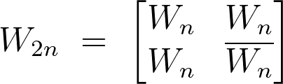
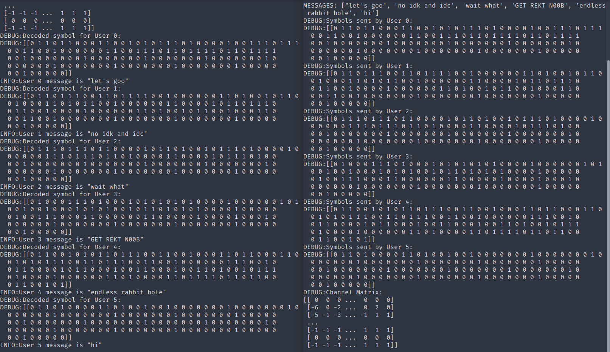

# CDMA Simulation 

Simulation of Code Division Multiple Access protocol using Walsh codes.

## Introduction

### CDMA
Code Division Multiple Access, CDMA is an innovative use of direct sequence spread spectrum technology used to provide a multiple access scheme for mobile telecommunications and other wireless systems. CDMA used the property of DSSS that unless the transmitter and receiver used the same spreading code for both ends of the process, the signal could not be decoded and in this way it was able to provide a means of enabling a variety of different users to use the same channel to access a base station without mutual interference.

CDMA has a number of distinguishing features that are key to spread spectrum transmission technologies:

- **Use of wide bandwidth**:  CDMA, like other spread spectrum technologies uses a wider bandwidth than would otherwise be needed for the transmission of the data. This results in a number of advantages including an increased immunity to interference or jamming, and multiple user access.
- **Spreading codes used**:   In order to achieve the increased bandwidth, the data is spread by use of a code which is independent of the data.
- **Level of security**:   In order to receive the data, the receiver must have a knowledge of the spreading code, without this it is not possible to decipher the transmitted data, and this gives a measure of security.
- **Multiple access**:   The use of the spreading codes which are independent for each user along with synchronous reception allow multiple users to access the same channel simultaneously.

### Correlation
Correlation is a method of measurement of how precisely a given signal matches with a desired code. In CDMA technology, each user is assigned with a different code, the code which is being assigned or chosen by the user is very important to modulate the signal because it is related to the performance of the CDMA system.

One will get best performance when there will be clear separation between the signal of desired users and signals of the other users. This separation is made by correlating the desired signal code which was locally generated and other received signals. If the signal matches with the code of the user, then the correlation function will be high and the system can extract that signal. If the user's desired code has nothing in common with the signal, the correlation should be as close to zero as possible (thus eliminating the signal); also known as cross correlation. 

It can be shown that *orthogonal codes* have a cross-correlation equal to zero; in other words, they do not interfere with each other. Orthogonal codes are mainly used in synchronous CDMA.

### Walsh Codes
Walsh Codes are most commonly used in the orthogonal codes of CDMA applications. These codes correspond to lines of a special square matrix called the Hadamard matrix. For a set of Walsh codes of length N, it consists of n lines to form a square matrix of *n×n* Walsh code. Walsh matrices are just Hadamard matrices and can be created using the given formula, given an initial matrix. This is also why Walsh codes are also called Walsh-Hadamard codes

 
  

## Code

The code in this repository makes use of python's inbuilt socket function to simulate simple CDMA-based communication. The program takes in 2 main arguments via CLI.
- Number of users
- Message to be sent by each user.

The code contains the following 3 files
- #### [transmitter.py](./transmitter.py)
Contains code for encoding the messages with respective Walsh codes and generating the final signal (matrix here) to be sent in the channel

- #### [receiver.py](./receiver.py)
Contains code for decoding the signal (matrix) from channel and decoding it with the same Walsh codes to obtain the respectives messages

- #### [utils.py](./utils.py)
Contains methods to generate Walsh matrices required (depending on no. of users) and to convert text string to binary array and vice versa.

The socket arguments are specified as follows: 
- address: `localhost`
- port: `3300`

These can be changed as per requirements.

*Additional comments providing a rough overview of the codeflow is also given*

## How to run

- Clone this repository and move into the cloned directory
- Run `python receiver.py <NO_OF_USERS>` first
- Run `python transmitter.py <NO_OF_USERS>` and enter the message to be sent for each user

### Optional

- Set logging level to `DEBUG`. (Default is `INFO`)
- The comments are written to be more useful if used in conjecture with [Better Comments Extension](https://marketplace.visualstudio.com/items?itemName=aaron-bond.better-comments) 

### Output Examples

With Logging level `INFO`

With Logging level `DEBUG`

## References

### Links

1. [Walsh Codes, PN Sequences and their role in CDMA Technology](https://www.cse.iitd.ac.in/~cs1120231/walsh.pdf)

2. [CDMA basics and Walsh codes](http://morse.colorado.edu/~tlen5510/text/classwebch7.html)

3. [Code division multiple access, Wikipedia](https://en.wikipedia.org/wiki/Code-division_multiple_access)

4. [CDMA Techniques](https://www.tutorialspoint.com/cdma/cdma_techniques.htm)

### Books

1.    T. Rappaport, Wireless Communications: Principles and Practice, 2nd ed., (Upper Saddle River, N.J.: Prentice Hall, 2002).

2.    A. Molisch, Wireless Communications, (Chichester, UK: IEEE press - John Wiley, 2005).